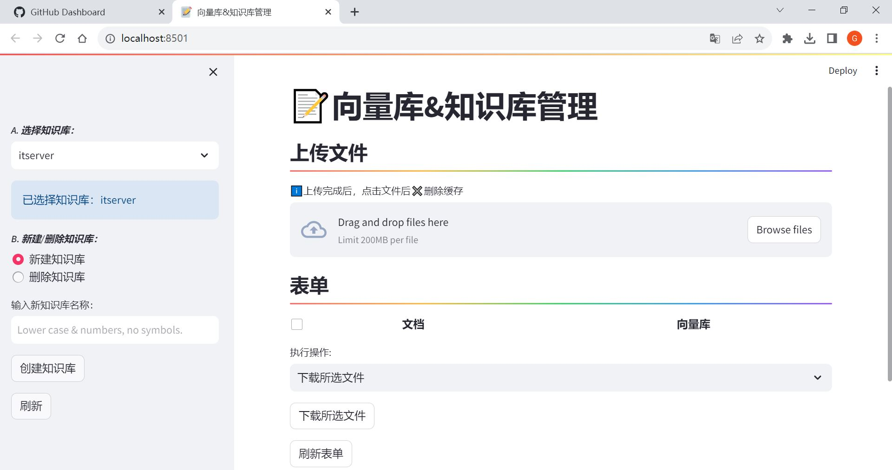

# Minio2Milvus-BackEnd

---

## 介绍

Milvus is the world's most advanced open-source vector database, built for developing and maintaining AI applications.

MinIO's High Performance Object Storage is Open Source, Amazon S3 compatible, Kubernetes Native and is designed for cloud native workloads like AI.

在使用ChatGPT做知识库问答系统的小伙伴会遇到Milvus与MinIO不能统一管理的问题，Minio2Milvus-BackEnd创建了一个由streamlit写得简易UI，同步Milvus与MinIO，实现新建库、删除库、上传文档、向量化文档、删除文档等功能。

---

## 开发部署

1. 先使用Docker部署Milvus（MinIO会在该步骤中一同部署完成）

2. Install packages: minio, pymilvus, langchain, streamlit, torch

3. 去HuggingFace下载BgeEmbeddings模型: BAAI/bge-large-zh

---

## 项目交流

微信： wanggx130